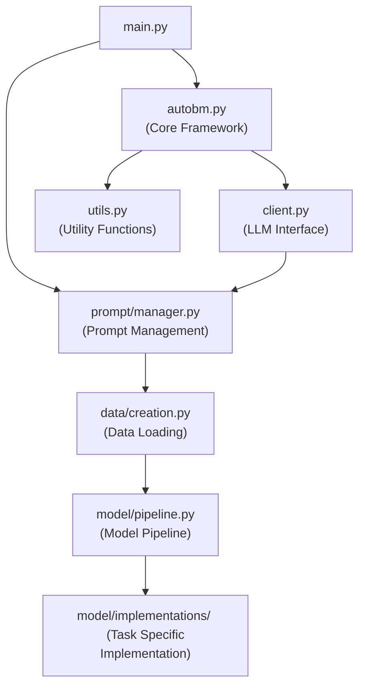

# AutoBM Project Detailed Overview

---

## 1. Code Structure Details

```
src/autobm/
├── main.py # Program entry point, responsible for initialization and flow startup
├── autobm.py # Core framework class, implementing the complete evolutionary algorithm and model management
├── client.py # LLM client wrapper, supporting various API providers (e.g., Qwen, Claude)
├── utils.py # Utility function collection, including code execution and verification
├── __init__.py # Package initialization file
│
├── data/ # Data processing module
│   ├── creation.py # Data loader, creating training/validation/test datasets for different tasks
│   └── datasets/ # Directory for actual data files
│   │   ├── cda.json # Continuous Double Auction market data
│   │   ├── proposer.csv # Ultimatum Game data
│   │   └── rps.json # Rock Paper Scissors game data
│
├── model/ # Model processing module
│   ├── pipeline.py # Model pipeline router, loading the corresponding implementation based on task type
│   ├── adapter.py # Model adapter, standardizing interfaces across different tasks
│   └── implementations/ # Specific implementations for each task
│   │   ├── ulti_pipeline.py # Ultimatum Game task implementation
│   │   ├── rps_pipeline.py # Rock Paper Scissors task implementation
│   │   └── cda_pipeline.py # Continuous Double Auction task implementation
│
└── prompt/ # Prompt management module
    ├── manager.py # Prompt manager, handling template rendering
    ├── templates/ # Prompt template directory
    │   ├── code.j2 # Code generation template
    │   ├── debug.j2 # Error debugging template
    │   ├── differ.j2 # Model differentiation template
    │   ├── init.j2 # Initialization template
    │   ├── judge.j2 # Model evaluation template
    │   ├── model.j2 # Model description template
    │   └── optimistic.j2 # Optimistic improvement template
    └── specific/ # Task-specific content
        ├── cda/ # Continuous Double Auction specific files
        ├── ulti/ # Ultimatum Game specific files
        └── rps/ # Rock Paper Scissors specific files
```

---

## 2. Detailed Execution Flow

### 2.1. Program Startup Phase (`main.py`)
* Reads the `pyproject.toml` configuration file.
* Initializes the LLM client and services.
* Creates the Prompt Manager.
* Loads the training, validation, and testing datasets.

### 2.2. Model Initialization Phase (`autobm.py`)
* Uses the LLM to generate the initial population of models (default 5 models).
* Each generated model undergoes validation:
    * Syntax checking.
    * Functional integrity verification.
    * Training and testing validation.
* Validated models are added to the model pool.

### 2.3. Evolutionary Algorithm Phase (`autobm.py`)
AutoBM uses an evolutionary algorithm to iteratively improve models, primarily involving the following steps:

#### Exploration
* Randomly selects existing models.
* Uses the `differ.j2` template to combine strategies from different models.
* Generates new model variants.

#### Improvement
* Uses a tournament selection algorithm to choose high-performing models.
* Uses the `optimistic.j2` template to optimize the selected models.
* Generates improved model versions.

#### Evaluation
* Trains each newly generated model.
* Tests the model performance on the validation set.
* Calculates the loss function value as the primary performance metric.

#### Selection
* Adds new models to the model pool.
* When the model pool exceeds maximum capacity, the worst-performing models are pruned.
* High-performing models are retained for the next evolutionary round.

### 2.4. Output and Saving Phase
* Saves the final model pool to `output/pkl/pool.pkl`.
* Saves training statistics to `output/csv/model_stats.csv`.
* Generates detailed performance reports and logs.

---

## 3. Detailed Module Interaction



---

## 4. Output File Details

### Main Output Directory Structure
```
output/
├── pkl/ # Serialized model files
│ └── pool.pkl # Final model pool, containing all saved models
├── csv/ # Statistical data
│ └── model_stats.csv # Performance statistics for each evolutionary generation
└── logs/ # Log files
 ├── autobm_run.log # Main execution log
 └── summaries/ # Intermediate result summaries
```

### Output Content Description
*   **pool.pkl**: Contains model strategy descriptions, generated code, training parameters, test loss, and other relevant information.
*   **model_stats.csv**: Records statistics such as the best loss and average loss for each evolutionary generation.
*   **autobm_run.log**: Detailed execution log, including specifics of each evolutionary step.

---

## 5. Complete Guide to Adding a New Scenario

To add a new task scenario, follow these steps:

### 5.1. Data Preparation
Add the new task's data file to the `src/autobm/data/datasets/` directory and implement the data loading function in `src/autobm/data/creation.py`:

```python
from typing import Tuple
from torch.utils.data import DataLoader

def create_dataset_newtask(
    data_file: str = GLOBAL_FILE_PREFIX+'newtaskdataset',
    batch_size: int = 32,
    seed: int = 42
) -> Tuple[DataLoader, DataLoader, DataLoader]:
    # Implement data loading and preprocessing logic here
    pass
```

Also, update the router function in `creation.py` to support the new task:

```python
elif current_task == "newtask":
    return create_dataset_newtask(
        batch_size=INTERNAL_BATCH_SIZE_ULTI_RPS,
        seed=INTERNAL_SEED
    )
```

### 5.2. Model Pipeline Implementation

Create the file `src/autobm/model/implementations/newtask_pipeline.py` and implement the following required functions:

```python
def train_model(model, train_loader, val_loader, **kwargs):
    """Trains the model"""
    pass

def test_model(model, test_loader):
    """Tests the model"""
    pass

def test_model_integrity(model, train_loader):
    """Verifies model integrity"""
    pass

def visualize_test(test_results):
    """Visualizes test results"""
    pass
```

### 5.3. Prompt Template Preparation

Create a new task directory `newtask/` within `src/autobm/prompt/specific/` and add the following files:

*   `game_desc.txt`: Game scenario description
*   `task_desc.txt`: Specific task instructions
*   `data_itf.txt`: Data interface specification
*   `code_tpl.txt`: Code template format
*   `output.txt`: Output format requirements

### 5.4. Prompt Template Update

If specialized prompt templates are required, create new template files within the `src/autobm/prompt/templates/` directory.

### 5.5. Configuration Update

Set `current_task` to the new task name in `pyproject.toml`:

```toml
[tool.autobm]
current_task = "newtask"
```

---

## 6. Quick Start Guide

### Environment Configuration

Ensure the `uv` tool is installed.

Edit the `pyproject.toml` file:

```toml
[tool.autobm]
current_task = "ulti"  # Options: "ulti", "rps", "cda", or your new task name

[tool.llm_client_config.model_mapping.quest]
provider_type = "" # See autobm.client.LLMClient for options
model = "model-name"
base_url = "your-api-base-url"
api_key = "your-api-key-here"

[tool.llm_client_config.model_mapping.code]
# same configuration as quest, or a different LLM for code generation
```

### Running the Program

```bash
# Run using uv
uv run python -m src.autobm.main
```